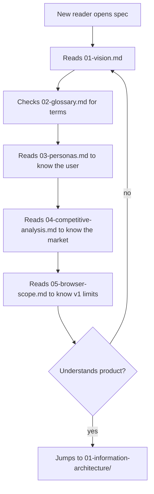

# 00-overview — Flow Diagram

**What this folder does (in one line):** sets the stage — vision, glossary, personas, competitors, browser scope.
**User perspective:** a new teammate (or AI model) lands here first to understand *what* we are building and *why*, before reading any code or other folder.

**Plain walkthrough:** Reader → Vision → Glossary → Personas → Competitors → Browser scope → ready to read the rest of the spec.
