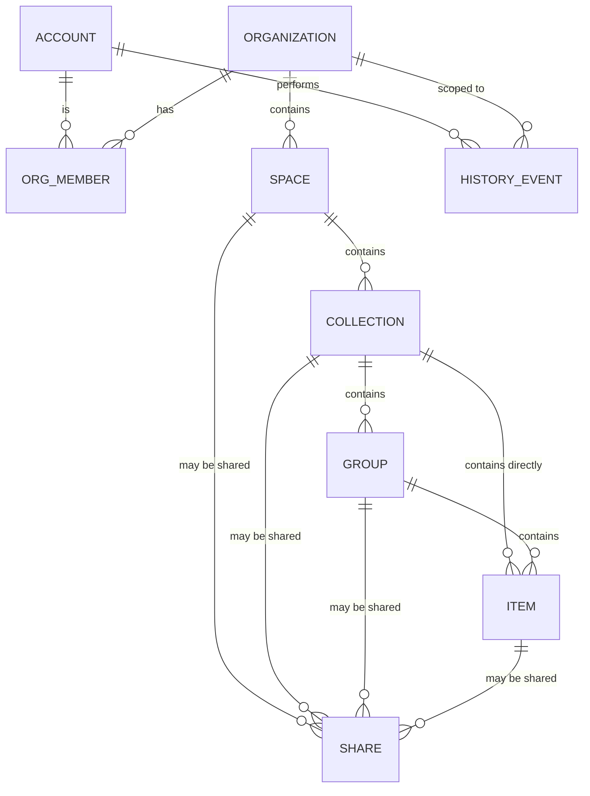

# Hierarchy

The complete information architecture of Lets Mark Now.

---

## 1. Levels

| Level | Entity | Required? | Multiplicity | Parent |
|---|---|---|---|---|
| L0 | **Account** | yes | 1 per human | — |
| L1 | **Organization** | yes | 1..N per Account (own or member of) | Account |
| L2 | **Space** | yes | 1..N per Organization | Organization |
| L3 | **Collection** | yes | 0..N per Space | Space |
| L4a | **Group** | optional | 0..N per Collection | Collection |
| L4b | **Item** | leaf | 0..N per Collection OR per Group | Collection or Group |

---

## 2. ASCII tree

```
Account (alim@example.com)
│
├── Organization "Personal" (PE)        ← left-rail bubble #1
│   ├── Members: [alim (Owner)]
│   ├── Subscription: Pro
│   └── Spaces:
│       ├── Space "My Collections"      (private)
│       │   ├── Collection "Marketing Improvements"
│       │   │   ├── Item "7 Habits of Highly Eff..."
│       │   │   ├── Item "Book Reviews"
│       │   │   └── Item "(37) Books about Money..."
│       │   └── Collection "Downloads" (empty)
│       └── Space "Evatix"              (shared with team)
│           ├── Collection "Scrum"
│           │   └── Items...
│           └── Collection "React"
│               ├── Group "Quick Tools" ← Tab Extend style sub-group
│               │   ├── Item "ChatGPT"
│               │   └── Item "Drive"
│               └── Item "react-spring"
│
└── Organization "Atto Property" (AP)   ← left-rail bubble #2
    ├── Members: [alim (Owner), sara (Editor)]
    ├── Subscription: Team
    └── Spaces:
        └── Space "Atto Quick"
            └── Collection "Atto Property"
                └── Items...
```

---

## 3. Rules

### 3.1 Naming

- Every entity has a `name` (1–120 chars, unicode allowed, leading/trailing whitespace stripped).
- Names are **not** unique across siblings. Two Collections in the same Space can be called "Untitled" — disambiguated by `id`.
- Empty name is rejected; default name is auto-generated (e.g. `New Collection`).

### 3.2 Nesting rules (LOCKED for v1)

- ✅ Organization may contain many Spaces.
- ✅ Space may contain many Collections.
- ✅ Collection may contain Groups **and/or** Items at the same level.
- ✅ Group may contain Items only.
- ❌ Group inside Group is **forbidden** in v1.
- ❌ Collection inside Collection is **forbidden**.
- ❌ Item is always a leaf.

> A future v2 may allow deeper nesting. Schema must reserve room (see `02-data-model/group.md` — `parent_group_id` field allowed but constrained to NULL in v1).

### 3.3 Ownership

- Every entity has exactly one **Organization** as its root owner.
- Moving an entity across Organizations is **not** a regular move — it is an **export-then-import** operation (see `11-import-export/`).
- Within an Organization, entities can be moved freely (Space ↔ Space, Collection ↔ Collection, Item ↔ Group ↔ Collection) by users with Editor+ role.

### 3.4 Sharing scope

| Entity | Can be shared via `letsmarknow.com/t/{slug}` | Notes |
|---|---|---|
| Account | ❌ | never shared |
| Organization | ❌ | shared via Member invites only (`08-sharing-collab/invite-only.md`) |
| Space | ✅ | yes |
| Collection | ✅ | yes |
| Group | ✅ | yes — fixes Tab Extend's #1 flaw |
| Item | ✅ | yes — single-item public link |

When a parent is shared, the share recursively exposes all descendants (read-only by default). Children can still have their **own** independent shares with different settings.

### 3.5 Soft delete

- Delete on any entity is soft (sets `deleted_at`). Hard delete happens after **30 days** in trash, or immediately on user-initiated "Empty Trash".
- Soft-deleted entities are restorable via Undo or via the Trash UI (see `12-history-undo/` and `07-features/delete-with-undo.md`).
- Soft-deleting a parent soft-deletes all descendants atomically. Restoring a parent restores all descendants that were soft-deleted in the same operation.

### 3.6 Counting toward plan limits

Per Organization (Free tier limits — exact numbers in `10-licensing-billing/plans-matrix.md`):

| Counted | Includes |
|---|---|
| Spaces | non-deleted |
| Collections | non-deleted, across all Spaces in the Org |
| Groups | non-deleted, across all Collections in the Org |
| Items | non-deleted, across the whole Org |
| Members | active + pending invites |
| Active Shares | non-expired, non-revoked |

> Soft-deleted entities do **not** count toward limits. Hard-deleted obviously do not.

### 3.7 Position / ordering

- Each entity has an integer `position` field within its parent (siblings ordered ascending).
- Default new entity → max(siblings.position) + 1024.
- Drag-drop reorders by inserting between neighbors at midpoint; periodic re-balance prevents float drift.
- Position re-balance is invisible to the user; emits no History Event.

### 3.8 Identifiers

- All entities use UUIDv7 (`id`). Reason: time-ordered, sortable, unguessable.
- Public Share slugs are separate from `id` (see `08-sharing-collab/share-link.md`).

### 3.9 Timestamps

- Every entity carries `created_at`, `updated_at`, `deleted_at` (nullable), `created_by` (Account id), `updated_by` (Account id).
- Items additionally carry `last_opened_at` (nullable) — updated when Jump-to-Tab or open-in-new-tab is invoked.

---

## 4. Entity capabilities matrix

| Capability | Org | Space | Collection | Group | Item |
|---|---|---|---|---|---|
| Has name | ✅ | ✅ | ✅ | ✅ | ✅ (= page title) |
| Has color | ❌ | ❌ | ✅ | ✅ | ❌ (uses parent color) |
| Has icon / favicon | ✅ avatar | ❌ | ✅ optional | ✅ optional | ✅ favicon (auto) |
| Has tags | ❌ | ❌ | ✅ | ✅ | ✅ |
| Has notes | ❌ | ✅ | ✅ | ✅ | ✅ |
| Has description | ✅ | ✅ | ✅ | ✅ | ✅ |
| Star/favorite | ❌ | ✅ | ✅ | ✅ | ✅ |
| Sharable via `/t/{slug}` | ❌ | ✅ | ✅ | ✅ | ✅ |
| Has members | ✅ | inherits | inherits | inherits | inherits |
| Counts toward Free limit | ✅ (count of Orgs) | ✅ | ✅ | ✅ | ✅ |
| Soft-delete | ❌ (hard via danger zone) | ✅ | ✅ | ✅ | ✅ |
| Move within Org | n/a | ❌ (root of Org) | ✅ across Spaces | ✅ across Collections | ✅ across Collections/Groups |
| Duplicate | ❌ (org clone is separate flow) | ✅ | ✅ | ✅ | ✅ |
| Bulk select | n/a | n/a | ✅ | ✅ | ✅ |

---

## 5. Cardinality limits (hard, regardless of tier)

These are hard product limits to keep performance bounded. They are **not** monetization limits.

| Limit | Value | Reason |
|---|---|---|
| Max Organizations per Account | 50 | UI sanity in left rail |
| Max Spaces per Organization | 500 | sidebar performance |
| Max Collections per Space | 5,000 | render performance |
| Max Groups per Collection | 500 | render performance |
| Max Items per Collection (direct) | 10,000 | render performance |
| Max Items per Group | 2,000 | render performance |
| Max name length | 120 chars | UI |
| Max description length | 4,000 chars | UI |
| Max note length | 8,000 chars | UI |
| Max tags per entity | 32 | UI / search index size |
| Max tag length | 40 chars | UI |
| Max members per Organization | 500 (Team) / 5 (Pro) / 1 (Free) | per `10-licensing-billing/plans-matrix.md` |

When a user hits a hard limit, the API returns `409 LIMIT_REACHED` with the limit name. UI shows a friendly explanation and links to docs.

---

## 6. Edge cases

| Case | Behavior |
|---|---|
| Delete a Space that contains shared Collections | Shares are revoked; viewers see "This share has been removed" page. History records who deleted. |
| Move a Collection to a Space the user is not a member of | Rejected `403 FORBIDDEN`. |
| Item URL changes (user edits) | Position preserved; favicon refetched async; History Event recorded. |
| Two users edit same Item simultaneously | Last-write-wins on per-field basis with optimistic concurrency token (`updated_at`). Conflict resolution: see `12-history-undo/conflict-resolution.md`. |
| Restoring a soft-deleted parent whose children were independently deleted | Only descendants soft-deleted in the same operation are restored. Independently deleted children remain in trash. |
| Sharing a Collection and then moving it to another Space | Share survives. Slug unchanged. Permissions inherited from new Space if Space is shared. |
| Removing a Member who created Items | Items remain (owned by Org); `created_by` retained for audit. |
| Account deletion | Transfers ownership of any Org where they are sole Owner is required first (or Org is deleted with grace period). See `19-security-privacy/gdpr-ccpa.md`. |

---

## 7. Diagram (Mermaid)



---

## 8. Things this file deliberately does NOT cover

- Field types and validation → `02-data-model/`
- Endpoint shapes → `03-api-endpoints/`
- UI representation → `06-ui-ux/`
- Sharing semantics in detail → `08-sharing-collab/`
- Plan limits in numeric detail → `10-licensing-billing/plans-matrix.md`
