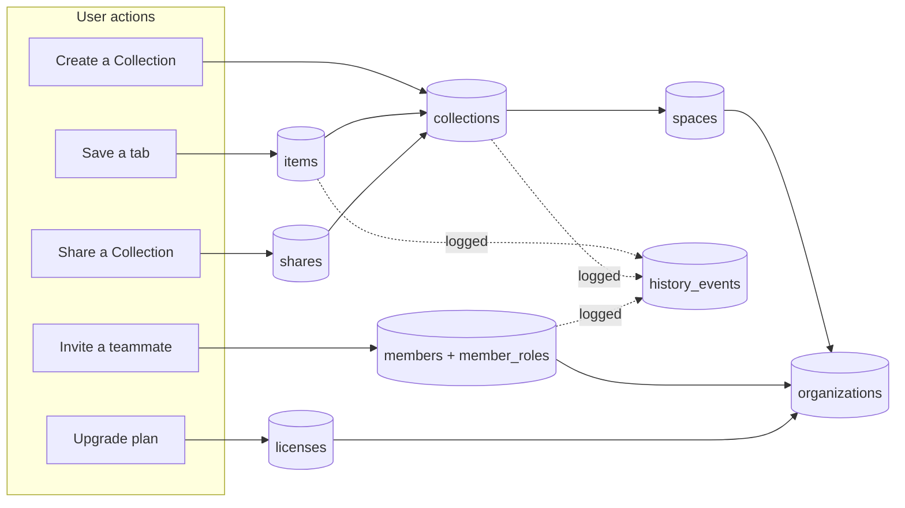

# 02-data-model — Flow Diagram

**What this folder does:** lists every table behind the scenes (Org, Space, Collection, Group, Item, Tag, Share, Member, History, License, Account).
**User perspective:** the user never sees this directly, but every click in the UI reads from or writes to one of these tables.

**Plain walkthrough:** Every user action lands in a table. Items live inside Collections, Collections inside Spaces, Spaces inside an Organization. Members + roles + licenses are also attached to the Organization. Almost every change is mirrored into `history_events` so the user can undo it later.
