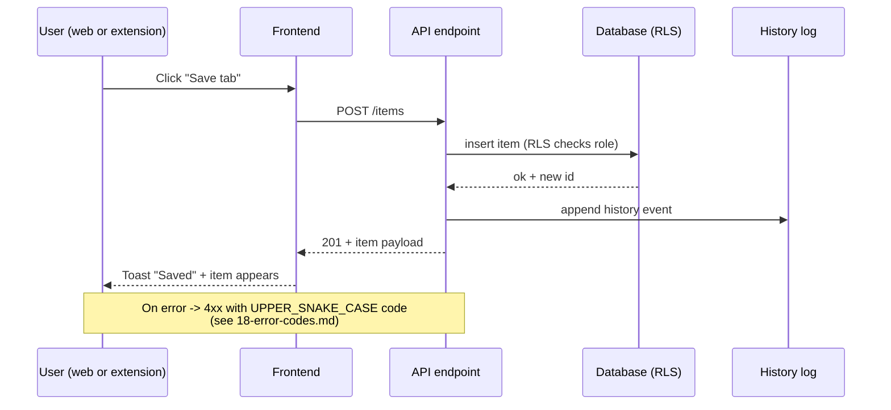

# 03-api-endpoints — Flow Diagram

**What this folder does:** defines the request → response contracts between the web app / extension and the backend.
**User perspective:** the user clicks a button → an endpoint fires → data changes → UI updates.

**Plain walkthrough:** User clicks → frontend calls the right endpoint → backend checks the user's role → DB writes → history log appended → response returned → UI shows the new item or an error toast with a stable error code.
