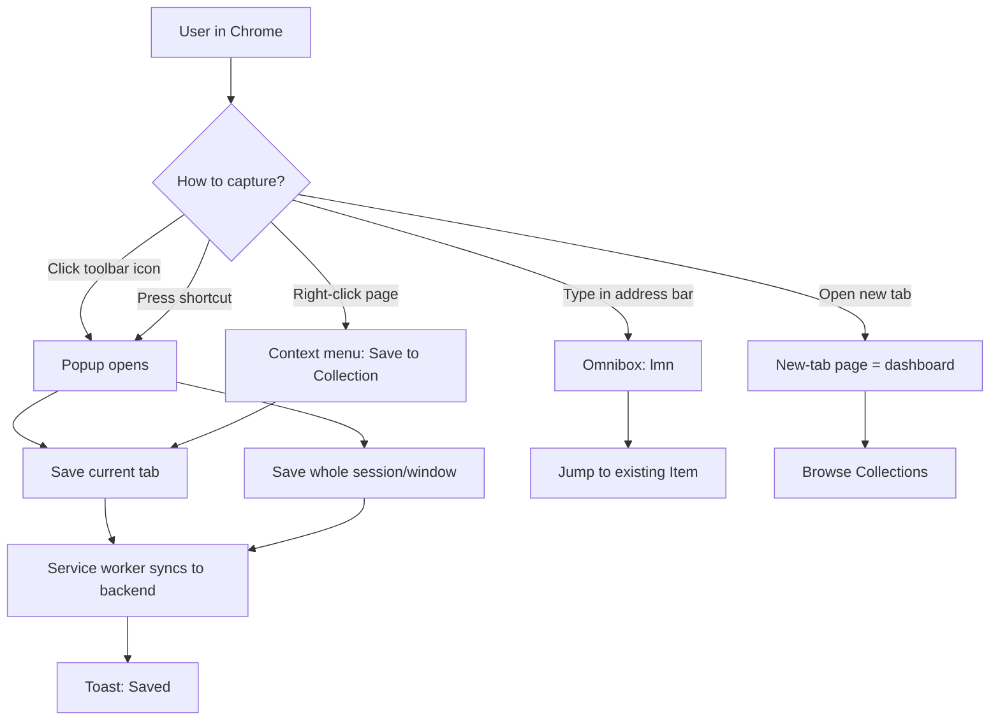

# 04-extension — Flow Diagram

**What this folder does:** the Chrome extension that captures tabs/sessions and provides quick search from anywhere in the browser.
**User perspective:** the extension is the fastest way *into* Lets Mark Now without opening the web app.

**Plain walkthrough:** User can save the current tab, the whole window, or jump to a saved item — from the popup, a keyboard shortcut, the right-click menu, the address bar, or the new-tab page. Anything saved goes to the service worker, which syncs it to the backend even if offline.
