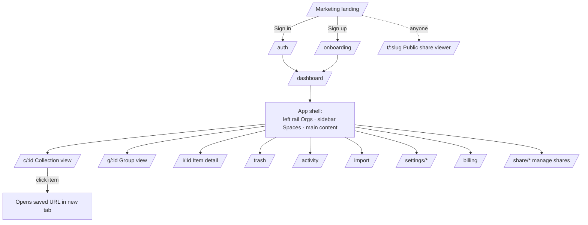

# 05-web-app — Flow Diagram

**What this folder does:** the website at letsmarknow.com — every route, screen, and navigation rule.
**User perspective:** what the user actually sees and clicks in the browser.

**Plain walkthrough:** Anonymous user lands on marketing → signs up → onboarding → dashboard. Inside the app shell they navigate to Collections, Groups, Items, Trash, Activity, Import, Settings, Billing, or Share management. Anyone (even logged-out) can open `/t/{slug}` to view a public share.
