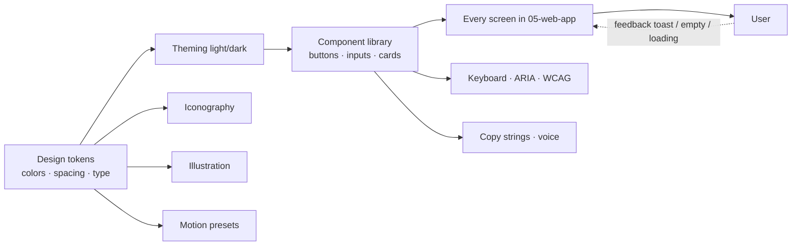

# 06-ui-ux — Flow Diagram

**What this folder does:** the design system — tokens, theming, components, motion, accessibility, copy strings.
**User perspective:** invisible plumbing that makes every screen feel consistent, fast, and accessible.

**Plain walkthrough:** Tokens define color/space/type → theming applies them light/dark → components consume them → screens compose components → user sees a consistent UI with proper keyboard, motion, and copy. Feedback (toasts, empty states, loading) loops back to the user.
