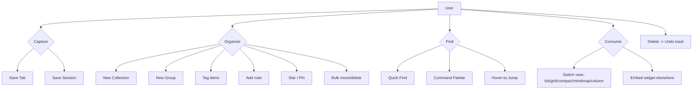

# 07-features — Flow Diagram

**What this folder does:** the product features themselves — Save Tab, Save Session, Quick Find, Collections, Groups, Tags, Notes, Views, Hover-to-Jump, Bulk ops, Star/Pin, Embeds, Command Palette, OS integrations, Feature flags, Delete-with-Undo.
**User perspective:** the verbs the user can perform.

**Plain walkthrough:** User has 4 verbs — capture, organize, find, consume — plus an always-available Undo. Each box maps to one file in this folder.
