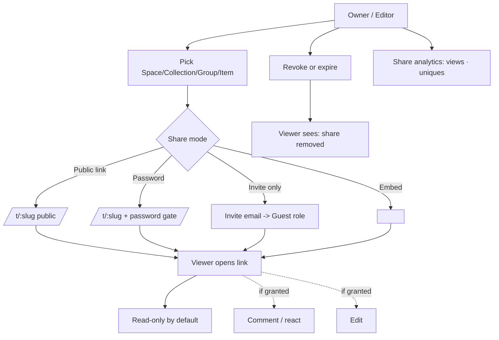

# 08-sharing-collab — Flow Diagram

**What this folder does:** how content leaves the Org — public links, password links, invite-only shares, embeds, comments, presence, analytics, revocation.
**User perspective:** "I want someone outside (or inside) to see this."

**Plain walkthrough:** Owner picks what to share → chooses mode (public / password / invite / embed) → viewer opens the link → reads, optionally comments or edits. Owner can revoke any share or watch its analytics.
