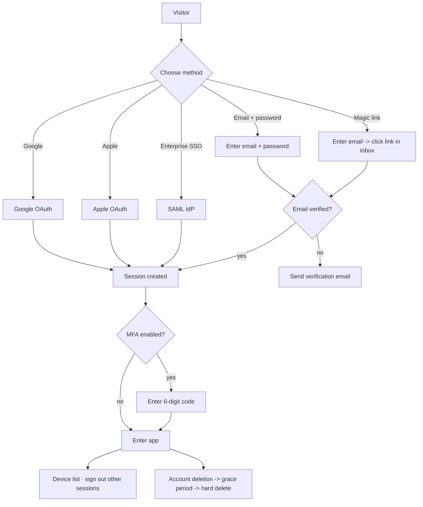

# 09-auth-accounts — Flow Diagram

**What this folder does:** identity — sign-up, sign-in, OAuth, SSO, sessions, MFA, email verification, account deletion, rate limits.
**User perspective:** how a person becomes (and stays) a logged-in user.

**Plain walkthrough:** Visitor picks a sign-in method → email is verified if needed → session created → MFA challenge if enabled → user is in. From settings they can manage devices or delete their account.
