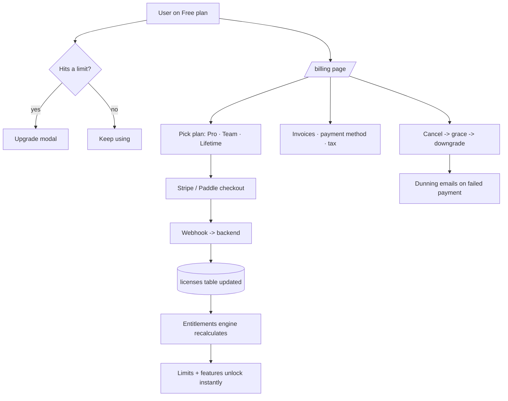

# 10-licensing-billing — Flow Diagram

**What this folder does:** plans, entitlements, Stripe/Paddle, lifetime licenses, seats, invoices, dunning, coupons, refunds, webhooks.
**User perspective:** "I want to upgrade / change plan / pay / cancel."

**Plain walkthrough:** User hits a Free limit → upgrade modal → checkout → webhook updates the license → entitlements engine flips features on. From the billing page they manage invoices, payment method, cancellation, and tax info.
