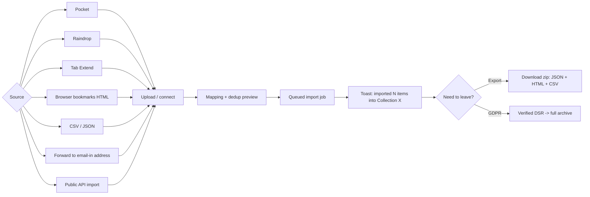

# 11-import-export — Flow Diagram

**What this folder does:** bringing data IN (Pocket, Raindrop, Tab Extend, browser bookmarks, CSV, JSON, email-in, API) and getting data OUT (export, GDPR, migration).
**User perspective:** "I'm coming from another tool" or "I need a copy of my data."

**Plain walkthrough:** User picks a source → uploads or connects → previews mapping + duplicates → job runs in the background → toast confirms. Later, they can export everything (or request a GDPR archive) and walk away with their data.
