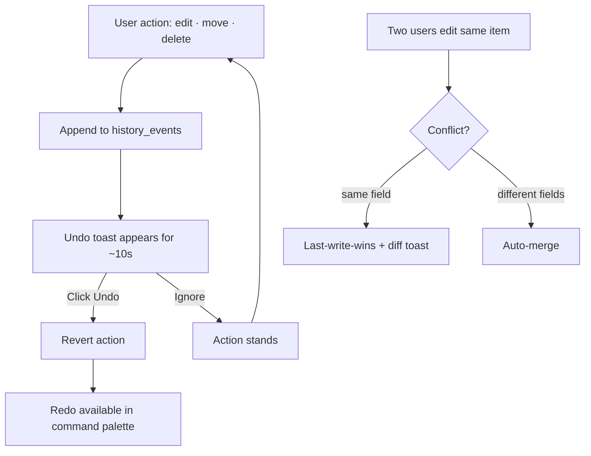

# 12-history-undo — Flow Diagram

**What this folder does:** every change is logged so the user can undo it, redo it, or resolve a conflict if two people edited at once.
**User perspective:** "Oops, bring it back."

**Plain walkthrough:** Every edit/move/delete is logged → an Undo toast pops up → click it to revert. If two people edit at the same time, the system either auto-merges (different fields) or applies last-write-wins with a notification (same field).
