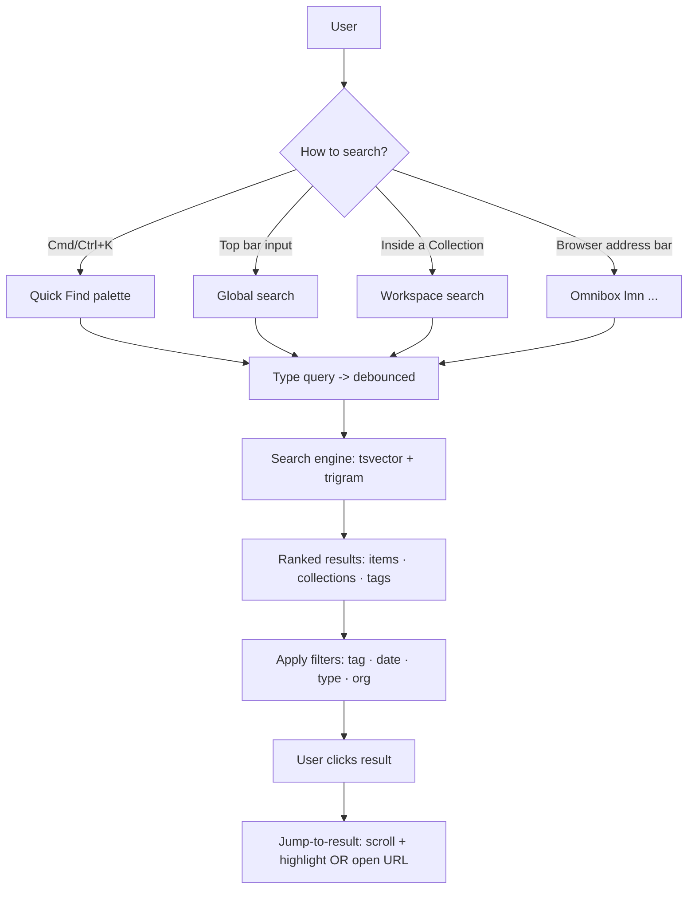

# 14-search — Flow Diagram

**What this folder does:** finding things — global search, item search, workspace search, filters, jump-to-result, the underlying search engine.
**User perspective:** "Where is that thing I saved last week?"

**Plain walkthrough:** User opens search from any of 4 entry points → types → backend ranks results → user filters/clicks → either jumps inside the app or opens the saved URL.
