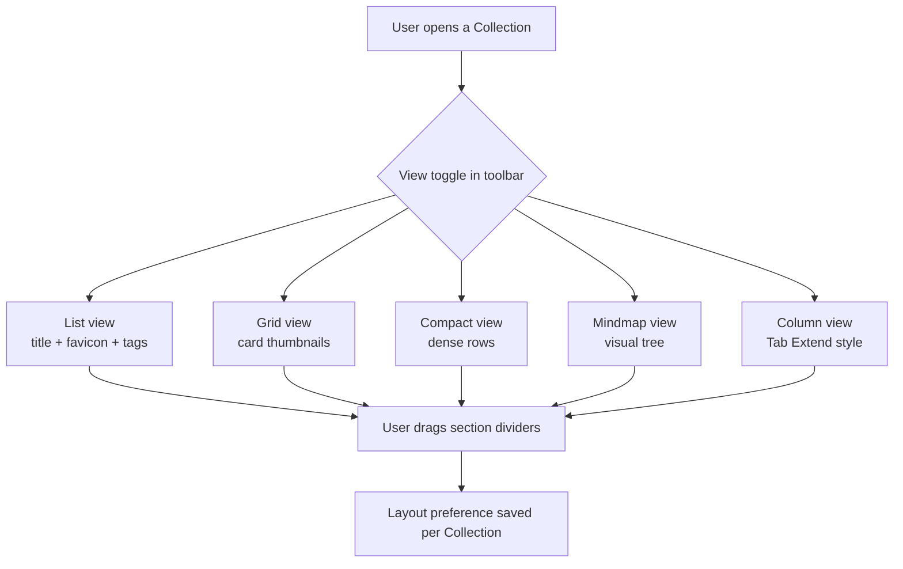

# 15-visualization — Flow Diagram

**What this folder does:** the different ways content is displayed — list, grid, compact, mindmap, Tab-Extend column view, plus resizable sections.
**User perspective:** "Show me my stuff the way I like to see it."

**Plain walkthrough:** User opens a Collection → switches view from a toolbar → optionally drags dividers to resize sections → preference is saved per-Collection so it stays that way next visit.
