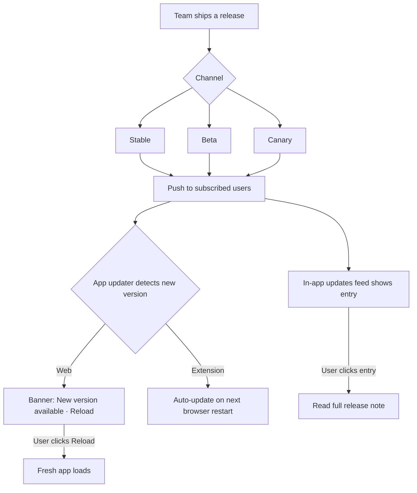

# 16-notifications-updates — Flow Diagram

**What this folder does:** in-app updates feed, app self-updater, release channels (stable / beta / canary).
**User perspective:** "What changed? And why is the app reloading?"

**Plain walkthrough:** Team publishes to a channel → users on that channel see the entry in the in-app feed and a "New version" banner → clicking reload gets the fresh version. Extensions update silently on next browser restart.
