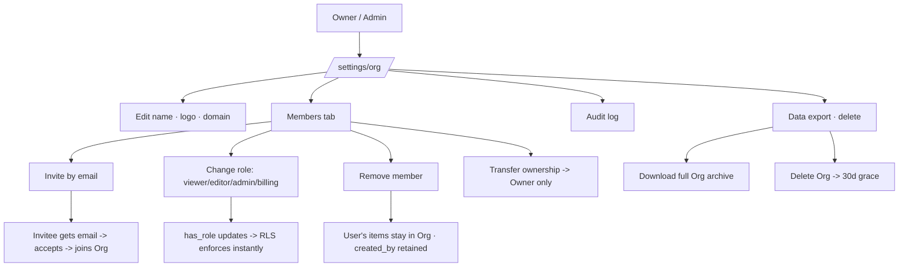

# 17-admin-org — Flow Diagram

**What this folder does:** organization-level controls — settings, members, roles & permissions, audit log, data export/delete.
**User perspective:** "I'm the Owner/Admin and I need to manage my team."

**Plain walkthrough:** Owner/Admin opens Org settings → manages name, members, roles, audit log, and data. Inviting sends an email; changing a role takes effect immediately; removing a member keeps their content but logs the change.
