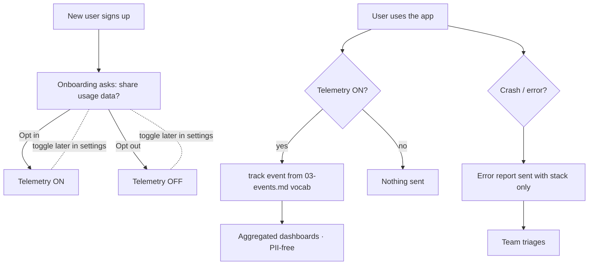

# 18-analytics-telemetry — Flow Diagram

**What this folder does:** opt-in usage analytics + error reporting + a fixed event vocabulary.
**User perspective:** mostly invisible, but the user controls whether it runs.

**Plain walkthrough:** During onboarding the user picks opt-in or opt-out. If opted in, predefined events are sent (no PII). Errors are reported with stack traces only, regardless of opt-in (per spec policy).
