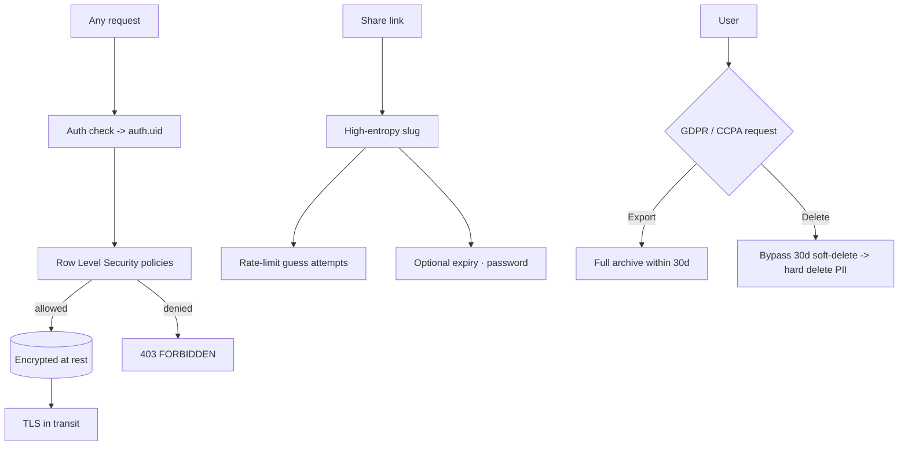

# 19-security-privacy — Flow Diagram

**What this folder does:** threat model, data handling, encryption, GDPR/CCPA, share-link security.
**User perspective:** "Is my data safe? Can I get it deleted? Can a bad actor steal a share link?"

**Plain walkthrough:** Every request is gated by auth + RLS; data is encrypted at rest and in transit. Share links use unguessable slugs and optional password/expiry. Verified GDPR requests bypass the normal trash grace period.
