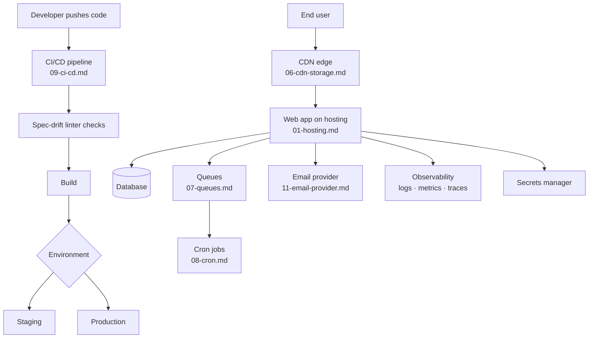

# 22-infrastructure — Flow Diagram

**What this folder does:** hosting, environments, env vars, secrets, domains/SSL, CDN/storage, queues, cron, CI/CD, observability, email, storage layout, IaC.
**User perspective:** the user never sees this, but every page-load + every saved item depends on it.

**Plain walkthrough:** Devs push → CI lints + builds + deploys to staging then prod. End users hit the CDN → app → database, with queues handling background work, cron handling schedules, email sending notifications, and observability watching it all.
