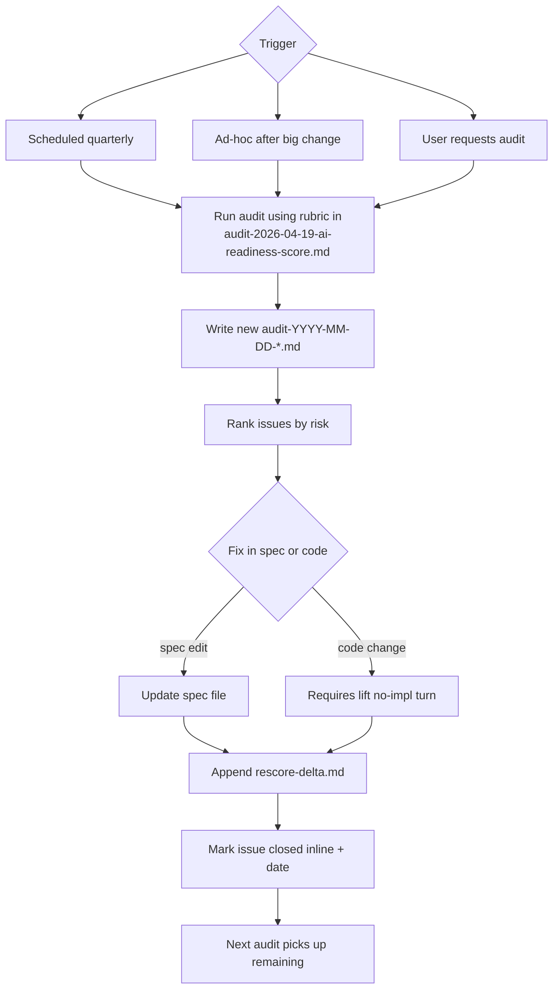

# 23-audits — Flow Diagram

**What this folder does:** scheduled and ad-hoc audits of the spec and the implementation, with a locked rubric and re-score policy.
**User perspective:** the *team* uses this to keep quality honest; the end user never sees it.

**Plain walkthrough:** Audits are triggered on a schedule, after big changes, or on user request → run with the locked rubric → produce a dated report → fixes are applied (spec or, with permission, code) → a rescore-delta is appended → closed issues are marked inline so nothing is silently dropped.
